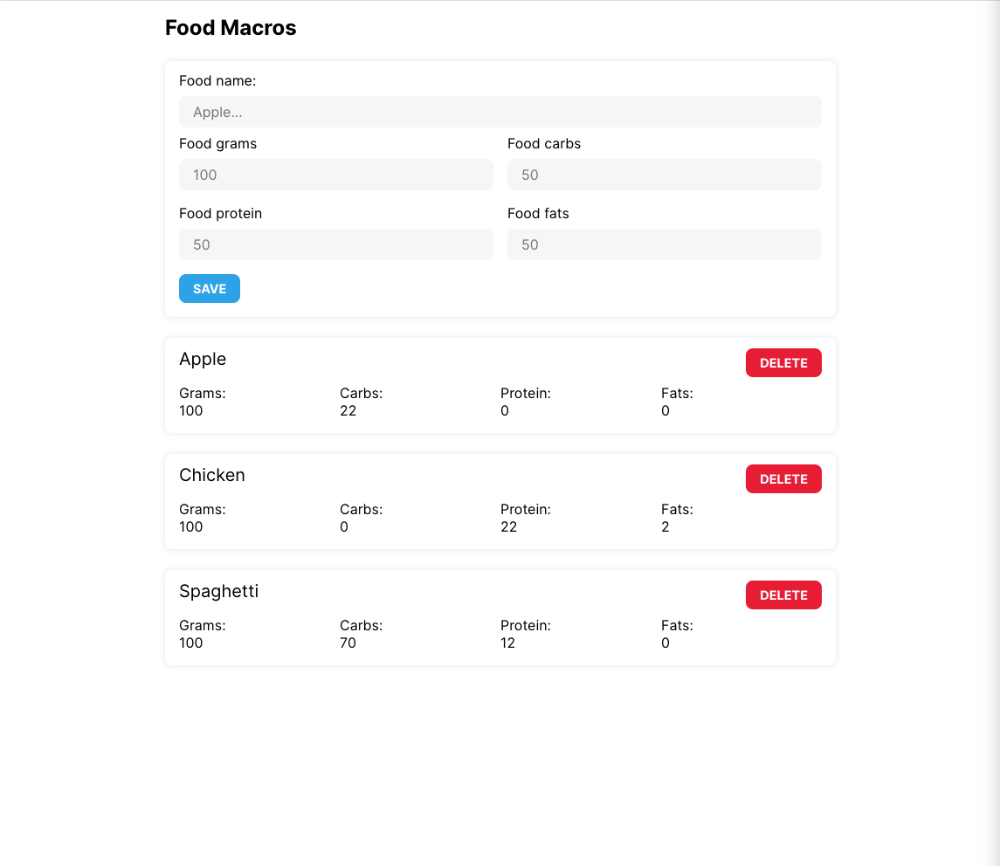
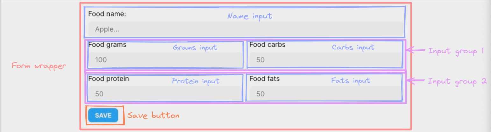
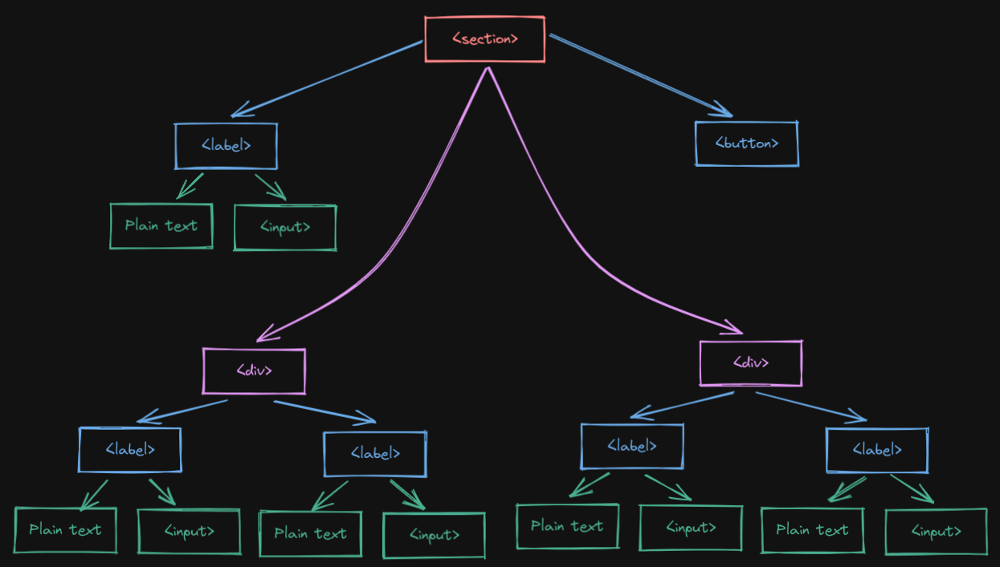
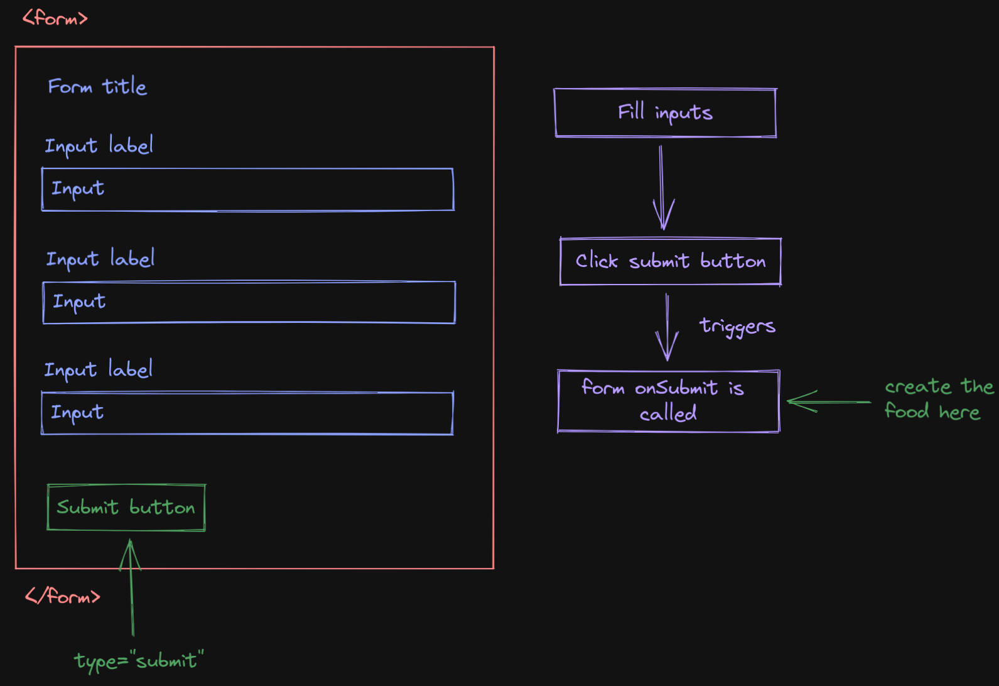
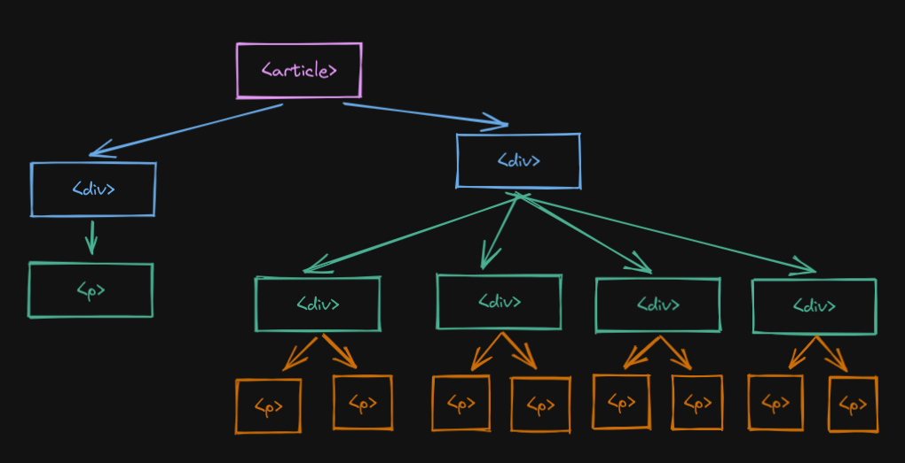

<!-- TOC ignore:true -->
# Instructions

In this document, you will have clear explanations about how to code the macros
application properly. Make sure that you follow all the steps.

> This assumes that you have already forked and cloned the repository.

<!-- TOC -->

- [Set up](#set-up)
- [Coding](#coding)
  - [Step one](#step-one)
  - [Step two](#step-two)
    - [Form without styles](#form-without-styles)
    - [Applying styles](#applying-styles)
  - [Step three](#step-three)
    - [Refactoring our components](#refactoring-our-components)
      - [Food form](#food-form)
      - [Input](#input)
  - [Step four](#step-four)
  - [Step five](#step-five)
    - [Communication with parent](#communication-with-parent)
    - [Receiving data in the parent component](#receiving-data-in-the-parent-component)
    - [Storing the foods](#storing-the-foods)
  - [Step six](#step-six)
    - [Step seven](#step-seven)
- [Additional features](#additional-features)
  - [Clear inputs](#clear-inputs)
  - [Delete buttons](#delete-buttons)
  - [Local Storage](#local-storage)

<!-- /TOC -->

## Set up

1. First of all, make sure you are in the `main` branch of the project.
2. Install all dependencies running on your terminal: `yarn`.
3. Start the application with `yarn serve` to see if it works. 

Other important things to note:

- You should create the folder structure that is demanded in each exercise.
- The project is set up using ESLint and Prettier, therefore make sure that you
  follow the rules and keep the code clean.
- There's no need to add any external dependency, everything is ready to start 
  working.
- I have provided you will all the styles, there's no need to add any other 
  style. All the styles are in `./src/global.css` and you can find all you will
  need in there.
- We will try to use semantic HTML, which is basically using proper HTML tags for
  the content that is being displayed.
- After finishing each step, it is strongly recommended to commit the changes.

This is the resulting application that we should build:



## Coding

### Step one

The entry point to our application is the `index.js` file. As you can see, this
file is mostly empty. We will create our first component, which will be the 
entrypoint to our application and we will add a header to the application.

1. Inside the `./src/pages` directory, create a new file named: `home.js`.
2. Inside this file, create a component named: `Home`.
3. As of now, this component will not have any logic. Return a `main` tag.
4. Add a children to the `main` tag that is a `header` tag.
5. This `header` tag, add a children that is an `h2` and has the text `Food
   macros`.
6. Open the application (start it if you hadn't done it yet) and see that the
   the content is displayed.
7. Add the classes required to the elements created so that it looks as in the
   results image.

### Step two

Now it's time for the form. The form will first be written inside the `Home`
component and we will later refactor it into its separated component. This
refactoring execution is commonly used when developing in React. You first
create a component and then you extract it in smaller components.  
Looking at the final design, we have to achieve this:



There are various things that we have to take into account:

- The wrapper of the form. This will allow us to keep the content grouped and
  keep it as a pack. 
- There are 5 inputs, 4 of which are half width. Inputs with half width are 
  also grouped in some sort of container.
- Finally, there's a submit button which allows the user to save the food.

#### Form without styles

As a first step, the items that compose the form should be displayed. Later, the
styles will be added:

1. In our home component, add a new `section` child to the `main` component. This
   `section` will be the wrapper of the form.
2. As a child of this `section` add a `form` tag. Using the `form` tag in a form 
   nearly mandatory for forms when structuring proper HTML.
3. Inside this form, add 5 `label` tags, one for each input. Each label should 
   have two children: a plain text (without any tag) and an `input` component
   (see the example below).
   1. For the first input, set the `label` text to: `Food name:`. To the `input`,
      add the `name` property with `foodName`; add the `placeholder` property
      with `Apple...`; add also the `id` property with `foodName` aswell.
   2. For the second input, set the `label` text to: `Food grams:`. To the `input`,
      add the `name` property with `foodGrams`; add the `placeholder` property
      with `100`; add also the `id` property with `foodGrams` aswell.
   3. For the fourth input, set the `label` text to: `Food carbs:`. To the `input`,
      add the `name` property with `foodCarbs`; add the `placeholder` property
      with `100`; add also the `id` property with `foodCarbs` aswell.
   4. For the third input, set the `label` text to: `Food protein:`. To the `input`,
      add the `name` property with `foodProt`; add the `placeholder` property
      with `100`; add also the `id` property with `foodProt` aswell.
   5. For the fifth input, set the `label` text to: `Food fats:`. To the `input`,
      add the `name` property with `foodFats`; add the `placeholder` property
      with `100`; add also the `id` property with `foodFats` aswell.
4. In previous image, inputs 2-3 and 4-5 are wrapped in a container. Add a `div`
   element that has both inputs 2-3 as children and a second `div` that does the
   same for the inputs 4-5. Make sure that your component tree looks as in the 
   following image.
5. Since the second, third, fourth and fifth inputs will only accept a number,
   pass the `type` property to the `input` with the `number` string as the value.
6. Finally, add a `button` as the last child of the `form`. Also, set the `type`
   prop of the `button` to `submit`. This will ensure that, when the `button` is
   clicked, the `onSubmit` method is called for the `form`. This is a common (and
   recommended usage when working with forms). This is explained more in depth in
   further sections.

This is the expected component tree:



`label` with text and `input` as children example:

```js
<label>
  Form label
  <input type="text" name="input-name">
</label>
```

#### Applying styles

Now it is time for styles. Here are a few tips (remember that all styles are
store in the [`global.css`](./src/global.css) file).

1. The `section` container should have a class 
2. The `label` container should have one class always and another class if the
   input is half of the width.
3. The `input` should also have a class.
4. Finally, each `div` that wraps two half `input`'s should also have a class.

> Check the result image to know how it should look.

### Step three

#### Refactoring our components

Now, there's a lot of repeated code in the component. There's five times the 
same lines, each with different `name`, `id`, label texts and similar. The next
step is to extract this components into their own files:

1. Create a new folder named `components` in the `src` folder.
2. In this `components` folder, create another folder named `input`.
3. Also, create a second folder in `components` named `pages. The folder
   structure should be as:

```sh
src/
├── components/
│   ├── food-form/
│   └── input/
└── pages/
```

##### Food form

1. First in the `food-form` folder, create one file named `food-form.js`.
2. Inside this file, create a new component named `FoodForm`.
3. Copy all the content **inside** the `section` of the `Home` page in the
   new `FoodForm` component. Now, the form should all be in the new
   component.
4. Next, import the `FoodForm` component in the `Home` page. Now, the `section`
   should have the `FoodForm` component as a child. This `FoodForm` component
   will contain the `form` tag and all the inputs.

##### Input

Now the code is still repeated, as we have not refactored the `label` yet.

1. In the newly created `input` folder, add a new file `input.js`.
2. In this new file, create a new component named `Input`.
3. Copy one of the `label` that are currently in the `FoodForm` and paste it
   in the newly created `Input` component.
  
At this point, the `Input` props have to also be refactored. The next step is
to find out which are the properties that should be given by the parent
component.

1. Replace the text in the `label` and replace it by a property of the component
   named `labelText`.
2. Replace the `name` and `id` prop in the `input` for a property in the
   component named `name`.
3. Replace the `placeholder` prop in the `input` for a property in the component
   named `placeholder`.
4. Replace the property `value` in the `input` for a property in the component
   named `type`.
5. The hard part, a property is needed that, if that property is said to `true`,
   the `label` will have the `half-input` class. Add a `half` prop that is
   responsible for accepting this value.

```js
// TIP: The signature of the component should be
export const Input = ({
  labelText,
  name,
  placeholder,
  type,
  half,
}) => {
  // ...component code
}
```

Finally:

1. Replace all the `label`'s inside `FoodForm` for the new `Input` component
   created.
2. Pass all the props that are required so that the application stays as it was
   before the refactor.
3. Remember that inputs 2-3 and 4-5 should stay in their `div` containers and
   should be `half` the width of the first one.

### Step four 

Now it is necessary to keep the state of the inputs. This means that it is
necessary to listen to `input` changes on their value. In this case, since
it is necessary to watch the changes for all `input`'s. In order to do this,
the state must be kept in the parent of all `input`'s, which is the `FoodForm`
component.

1. In the `FoodForm` component, create a new state. Name the state value:
   `values`; and the state dispatcher: `setValues`.
2. The state should be an object that will have the following properties:
   1. `foodName`: it will keep the name of the food.
   2. `foodGrams`: it will keep the grams of the food.
   3. `foodCarbs`: it will keep the carbs of the food.
   4. `footProt`: it will keep the protein of the food.
   5. `foodFats`: it will keep the fats of the food.
3. Create a new method that is named `handleOnInputChange` that will
   receive an event. Use this event to update the state of the form. You can
   use the properties `event.target.name` to identify the `input` and the
   `event.target.value` to get the written value.
4. Add a new property to the `Input` component that is named `onChange`.
5. Pass this `onChange` property to the `input`'s `onChange` inside the
   `Input` component.
6. Now that the `Input` component accepts an `onChange` property which is
   forwarded to the `input` component, pass the `handleOnInputChange` to this
   new `onChange` property.

Try writting on the inputs and check if the state is updated accordingly.

### Step five

At this time, the application is able to track the changes on our `input`'s,
meaning that the application will have the information required to create a
food.  
In the `FoodForm` component there's defined a `form` component with a child that
is a `button`. This `button` allows the user to confirm their changes, which
technically speaking, is: to submit the form. This `button` has the property
`type` set to `submit`. When a `button` with such type is located inside a
`form`, it will trigger the `onSubmit` callback of the `form` input. 



More in depth, this is what happens:

1. The user fills the inputs. In this case, the application is keeping track of
   the inputs through a `useState`.
2. Once the inputs have been filled, the user will submit the data through the
   button.
3. By clicking this button, the `onSubmit` property, which is a callback, in the
   `form` component will be called.

#### Communication with parent

The current step is to be able to access the created food and save it in a sate,
the local storage or in a database. In this application it will be kept in
internal state, for simplicity:

1. Add a prop to the `FoodForm` component named `onSubmit`. This argument will
   be a callback that will be called when the form is submitted with all the
   input data.
2. Add the property `onSubmit` to the `form` in the `FoodForm` component and
   pass a function named `handleOnSubmit` which will be defined in the next step.
3. Inside this `FoodForm` component, add a handler named `handleOnSubmit`. This
   function has an argument named `e`, which is the `event` of the onSubmit.
4. This function will do the following things:
  1. First, call the `preventDefault()` method from the `event` that is received
     as an argument. This ensures that the `form` does not refresh the page,
     which is the default behaviour. That's the reason of the naming, to prevent
     the form from executing its default behaviour.
  2. Call the `onSubmit` property that the `FoodForm` component receives with
     the values of the different inputs, which are stored in the state.

#### Receiving data in the parent component

With this steps, the `FoodForm` component is able to communicate to its parent
the data that the user has written in the different inputs. The parent of the
`FoodForm` is the `Home` component.

1. In the `Home` component create a new handler that receives an object which
   will be the input data. Name it `onSubmitFood`.
2. Pass the `onSubmitFood` callback to the `onSubmit` prop of the `FoodForm`
   component inside the `Home` component.
3. Add a `console.log` that prints out the data of the form, inside the
  `onSubmitFood`.

> Try filling the inputs and clicking the submit button. Is the output displayed
> in the console? (It should)

#### Storing the foods

As said previously, we want to store the food in a state, which means inside of
a component. This component is the `Home` component as it will also be
responsible for rendering the component that will contain the list of foods that
have been created. However, at this point, there's no current state that holds
the list of products that have been created by the user:

1. Create a new state that will be a list inside the `Home` component.
2. Insinde the `onSubmitFood` handler, update the state so that the data that is
   received (the new food) it is stored in the state.

With this two simple steps, the application is now capable of keeping the list
of foods.

### Step six

Next step is to render the list of items. 

1. Create a new folder inside `components` named `food-item`.
2. Inside this `food-item` folder, create a `food-item.js` file.
3. Create a component inside `food-item.js` named `FoodItem`.
4. This component should have a prop named `food` which will be the food that it
   is supposed to render.
5. The component should contain:
  1. An `article` that will wrap the content.
  2. A first container that will wrap the header.
  3. Inside this first wrapper, add a `p` that will be the header and will
     render the name of the food received from props.
  4. Create a second container, also as a child of the `article` that will be
     the food content.
  5. In this second container add 4 childs that will act as wrappers aswell.
  6. Each wrapper should hace a `p` to display `Grams`, `Carbs`, `Proteins` or
     `Fats`. Also, each container should have a second `p` that will display the
     actual value of the food.
6. Add the classes to all elements that are required so the application looks
   like the image one.

The component tree from the `FoodItem` should look:



#### Step seven

Last step before finishing the application is to render the list of foods.

1. Inside the `Home` component, iterate through the list of foods that is stored
   as part of the state and render a `FoodItem` for each food item.

## Additional features

Here's a list of addintional features that you can add once you have finished
the application. These features are not guided as they should be personal
exercise which will help on practising what has been shown in this "course".
This features may require the usage of classes and all the classes are defined
in the `global.css` file. **There should be no need to add any class
whatsoever**.

### Clear inputs

When the user creates a food, the inputs are not resetted. Add such
functionality so that whenever the submit button is pressed, the inputs do not
contain any value.

### Delete buttons

As it is shown in the initial design, the `FoodItem` component has a delete
button. Basically, when the user clicks on the delete button, it will delete
that food. An alert can also be added so that the user does not missclick the
delete button.

### Local Storage

Add the possibility of storing the list of foods into the local storage, so that
when the user accesses the application again it will be able to see the foods
they had previously added. Some things to take into account:

- When creating a food, such food should be saved to the local storage.
- When the `Home` is first rendered, it should see if the local storage has any
  data.

> Here's some information from the MDN: https://developer.mozilla.org/en-US/docs/Web/API/Window/localStorage
